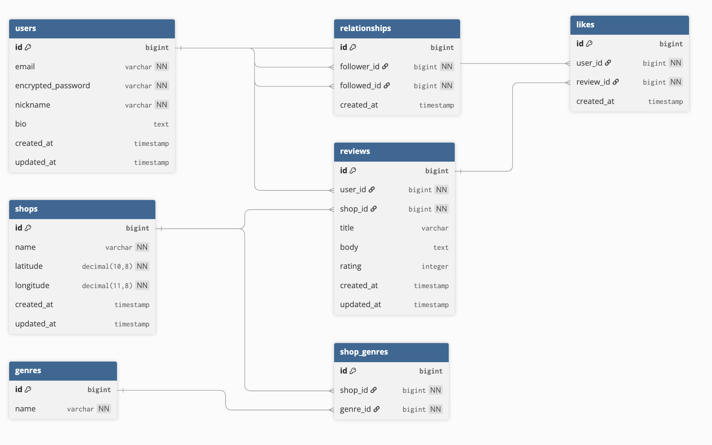

# ■ サービス概要

GochiLogは、飲食店のレビューを投稿・共有し、地図上で確認できるWebアプリです。
ユーザーは店名とレビュー内容を入力し、地図をクリックして位置情報を登録することで、おすすめの飲食店を記録できます。
投稿されたレビューは一覧ページと地図ページの両方で確認できるため、他のユーザーはレビュー内容だけでなく場所も含めて直感的に飲食店を探すことができます。

# ■ 開発背景

私は趣味でグルメ巡りをすることが多く、これまでさまざまな飲食店を訪れてきました。
しかし、

「以前行ったお店を忘れてしまう」
「美味しかったお店を他の人におすすめしたいが、場所をうまく伝えられない」

と感じることが何度もありました。
写真だけではお店の正確な位置を振り返ることが難しく、メモアプリでは位置情報とあわせて管理することができないため、過去に訪れたお店を整理して記録することに不便さを感じていました。
そこで、訪れた飲食店を地図とともに記録し、自分の思い出として振り返るだけでなく、他の人にも分かりやすく共有できるアプリとしてGochiLogを開発しました。

# ■ ユーザー層について

・グルメ巡りが好きな人
・外食が好きな人
・美味しいお店を記録したい人
・おすすめのお店を共有したい人
・新しい飲食店を探したい人

# ■ サービスの利用イメージ

① ユーザー登録・ログイン

② 地図ページで飲食店を探す

③ マーカーをクリックしてレビューを見る

④ 自分のおすすめ店を投稿

⑤ 投稿時に地図をクリックして位置を指定

⑥ 投稿後、地図上にマーカーが表示される

⑦ 他のユーザーとおすすめを共有できる

# ■ ユーザーの獲得について

以下の方法での獲得を想定しています：

・ポートフォリオとして公開
・SNS（X）での発信
・友人・知人への紹介

# ■ サービスの差別化ポイント・推しポイント

① 地図クリックによるレビュー投稿

住所入力ではなく、地図をクリックするだけで位置登録が可能
なため、直感的に投稿できます。

② 地図中心のUI設計

レビューを一覧だけでなく、地図上のマーカーとして表示
することで、位置関係を把握しやすくしています。

# ■ 機能候補

MVP

■ 認証機能

・ユーザー登録（Devise）
・ログイン
・ログアウト

■ プロフィール機能

・プロフィール一覧
・プロフィール詳細
・プロフィール編集
・プロフィール削除

■ レビュー機能

・レビュー投稿
・レビュー一覧
・レビュー詳細
・レビュー編集
・レビュー削除

■ 画像投稿機能

・画像投稿

■ 地図機能（Google Maps API）

・地図表示
・地図クリックで位置取得
・投稿位置のマーカー表示

本リリース

■ いいね機能

■ ジャンル機能

■ フォロー機能

■ 検索機能

■ 現在地表示機能

# ■ 使用する技術スタック

| カテゴリ | 技術 | 
| --- | --- |
| フロントエンド | Tailwind-css |
| バックエンド | Ruby on Rails |
| データベース | PostgreSQL |
| 環境構築 | Docker |
| インフラ | Render / Neon / Amazon S3 |
| ライブラリ | devise / geocoder / kaminari / ransack |
| 外部API | Google Maps API | 

# ■ ER図

# ■ 画面遷移図

近日中に公開予定

https://www.figma.com/make/telPaUVUYb2WwyJBLtoORT/GochiLog?p=f&t=FnTdhjS7qyvcOQS0-0