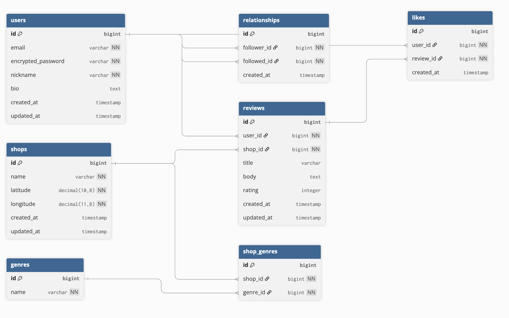
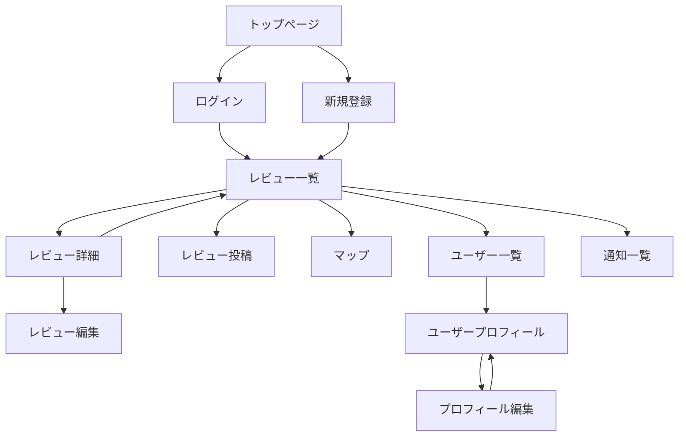

# GochiLog

GochiLog は、グルメ体験を記録・共有できるレビューアプリです。
お気に入りのお店をマップ上で探したり、フォローしているユーザーのレビューを通じて新しいお店と出会えます。

## URL
https://gochi-log.onrender.com

　

## サービス概要

GochiLog は「食べた体験」を記録し、地図と一緒に振り返れるグルメレビューサービスです。

お店の名前・評価・感想を投稿するだけでなく、Google Maps と連携したマップ画面でお店の位置を確認したり、現在地周辺のお店を探すこともできます。フォロー機能・いいね機能・コメント機能を通じて、ユーザー同士がつながれる設計にしています。

## 開発背景

私は趣味でグルメ巡りをすることが多く、これまでさまざまな飲食店を訪れてきました。

しかし、「以前行ったお店を忘れてしまう」「美味しかったお店を他の人におすすめしたいが、場所をうまく伝えられない」と感じることが何度もありました。

写真だけではお店の正確な位置を振り返ることが難しく、メモアプリでは位置情報とあわせて管理できません。そこで、訪れた飲食店を地図とともに記録し、自分の思い出として振り返るだけでなく、他の人にも分かりやすく共有できるアプリとして GochiLog を開発しました。

## 使い方

### 1. アカウント作成
メールアドレスまたは Google アカウントで登録できます。

### 2. レビューを投稿する
「レビューを書く」からお店の名前・評価（1〜5）・感想・ジャンル・写真を投稿できます。
店名を入力すると Places Autocomplete が候補を表示し、選択すると地図が自動でそのお店に移動します。

### 3. マップで探す
マップ画面ではレビュー済みのお店がピンで表示されます。「現在地を表示」ボタンで自分の位置を青丸マーカーで確認できます。

### 4. フォロー・いいね
気になるユーザーをフォローしたり、レビューにいいねやコメントができます。
フォロー数・いいね数は Action Cable によりリアルタイムで更新されます。

### 5. 通知
いいね・フォロー・コメントを受けると、ヘッダーの通知ベルにリアルタイムでバッジが表示されます。

## 技術的に工夫した点

### Google Maps API の活用

レビュー投稿時の「店名入力の手間を減らしたい」「住所も自動で取得したい」というユーザー体験の課題に対し、3 つの API を組み合わせて解決しました。

| API | 用途 |
|-----|------|
| Maps JavaScript API | マップ表示・マーカー描画 |
| Places API（Autocomplete） | 店名入力時の候補表示・地図自動移動 |
| Geocoding API（逆ジオコーディング） | 緯度経度から住所文字列を取得して表示 |

**実装の流れ**

1. 店名入力欄に Places Autocomplete を設定し、候補を表示
2. ユーザーが候補を選択すると、その店舗の緯度・経度を取得してマップが自動移動
3. 取得した緯度・経度を Geocoding API に渡し、住所文字列を逆引きして表示

```javascript
// 店名選択 → マップ移動 → 住所取得の一連のフロー
autocomplete.addListener("place_changed", () => {
  const place = autocomplete.getPlace()
  const location = place.geometry.location
  map.setCenter(location)
  geocoder.geocode({ location }, (results) => {
    document.getElementById("address").value = results[0].formatted_address
  })
})
```

これにより、店名を選ぶだけで位置情報・住所が自動入力され、投稿時の手間を大幅に削減しています。

## テスト

### テスト方針
壊れると困る箇所を中心にテストを書いています。バリデーションや「ログインしていないと操作できない」といったアクセス制御を重点的に検証しています。

- **モデルテスト**：バリデーション・アソシエーション・スコープの検証
- **リクエストテスト**：各アクションのレスポンスコードと認可の検証

### CI
GitHub Actions により、PR ごとに RSpec を自動実行しています。

### Lint
RuboCop を導入し、コードスタイルの統一を CI で担保しています。

## 技術スタック

| 分類 | 技術 |
|------|------|
| バックエンド | Ruby on Rails 7.2 |
| フロントエンド | Tailwind CSS / Hotwire（Turbo + Stimulus） |
| データベース | PostgreSQL |
| 認証 | Devise + OmniAuth（Google） |
| 画像管理 | Active Storage + AWS S3 |
| リアルタイム通信 | Action Cable + Redis |
| 検索 | Ransack |
| ページネーション | Kaminari |
| 外部 API | Google Maps / Places / Geocoding API |
| インフラ | Render |
| 開発環境 | Docker |
| テスト / CI | RSpec + GitHub Actions |
| Lint | RuboCop |

## 技術選定理由

| 技術 | 選定理由 |
|------|----------|
| Ruby on Rails | 開発速度が高く、Web アプリに必要な機能が揃っているフルスタックフレームワーク |
| PostgreSQL | 本番環境（Render）との互換性が高く、地理情報（緯度・経度）の管理にも適している |
| Tailwind CSS | ユーティリティファーストで素早くスタイリングでき、レスポンシブ対応が容易 |
| Hotwire（Turbo + Stimulus） | Rails との親和性が高く、JavaScript の記述量を最小限にしつつ SPA 的な UX を実現できる |
| Action Cable + Redis | WebSocket によるリアルタイム通信を Rails 標準機能で実装できる。Redis を pub/sub バックエンドとして使用し本番環境での安定動作を確保 |
| Devise | Rails 向けの認証 gem として実績があり、Google 認証との統合や remember_me などを短期間で実装できる |
| Active Storage + AWS S3 | Rails 標準の画像管理機能で導入コストが低く、本番環境では S3 に切り替えることで安定したストレージを確保できる |
| Google Maps API | 地図表示・店名補完・住所取得に必要な API が一括で揃っており、ドキュメントが充実している |
| Ransack | Rails と親和性が高く、モデルの検索機能を少ない記述量で実装できる |
| Kaminari | Rails で広く使われているページネーション gem で、Ransack との組み合わせが容易 |

## ER 図



## 画面遷移図


```mermaid
flowchart TD
    A[トップページ] --> B[ログイン]
    A --> C[新規登録]
    B --> D[レビュー一覧]
    C --> D
    D --> E[レビュー詳細]
    D --> F[レビュー投稿]
    E --> G[レビュー編集]
    E --> D
    D --> H[マップ]
    D --> I[ユーザー一覧]
    I --> J[ユーザープロフィール]
    J --> K[プロフィール編集]
    K --> J
    D --> L[通知一覧]
```

## 実装済み機能一覧

| 機能 | 詳細 |
|------|------|
| ユーザー認証 | Devise・Google OAuth・オートログイン |
| レビュー | 投稿・一覧・詳細・編集・削除・画像アップロード |
| 星評価・ジャンル | 1〜5 評価・ジャンル分類 |
| マップ | Google Maps 表示・現在地表示・マーカー描画 |
| 店名検索 | Places Autocomplete・住所自動取得 |
| いいね | Turbo Stream + Action Cable リアルタイム更新 |
| コメント | Turbo Stream によるリアルタイム追加 |
| フォロー | Turbo Stream + Action Cable リアルタイム更新 |
| 通知 | Action Cable によるベルバッジのリアルタイム表示 |
| 検索 | Ransack によるユーザー・レビュー検索 |
| ページネーション | Kaminari（12件/ページ） |
| レスポンシブ | Tailwind CSS のブレークポイント対応 |
| 管理者機能 | ユーザー・レビュー管理 |
| テスト | RSpec（モデル・リクエスト）+ GitHub Actions CI |
